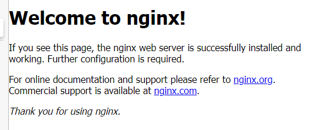
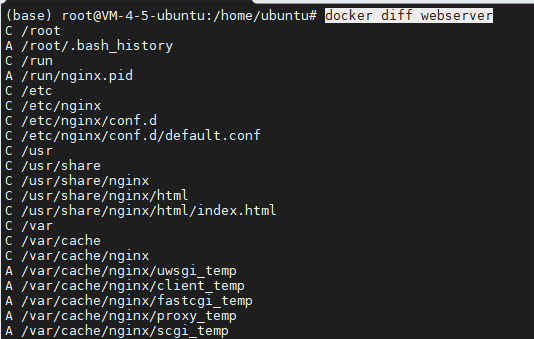
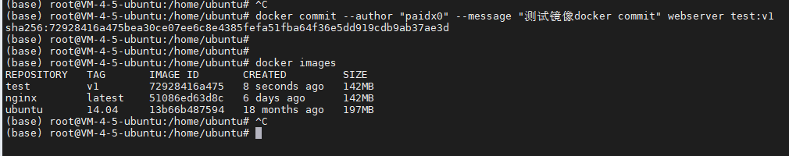
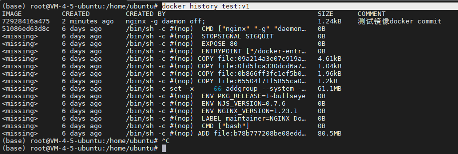
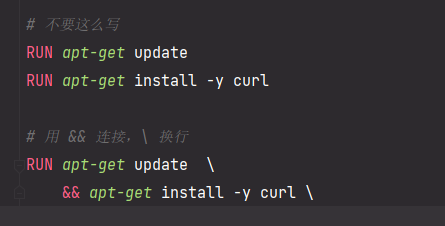
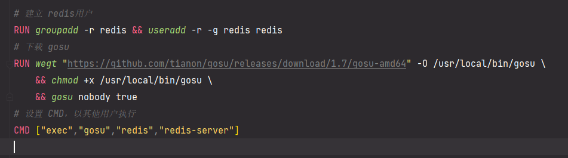
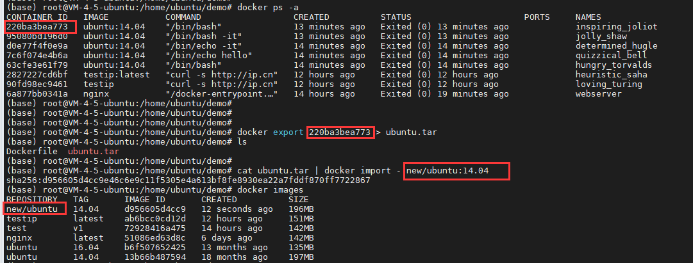
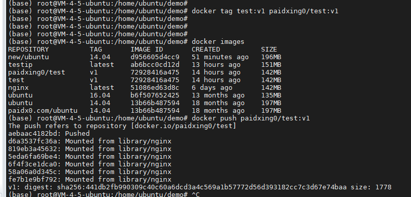
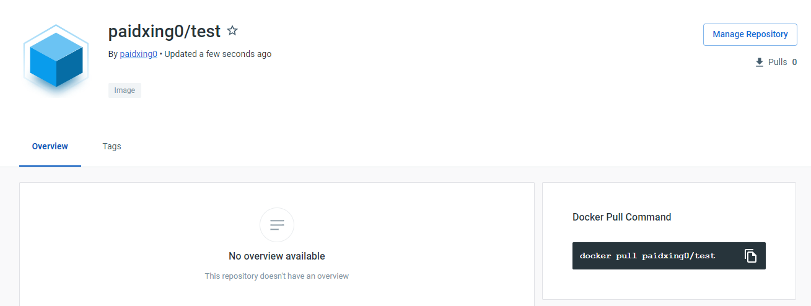
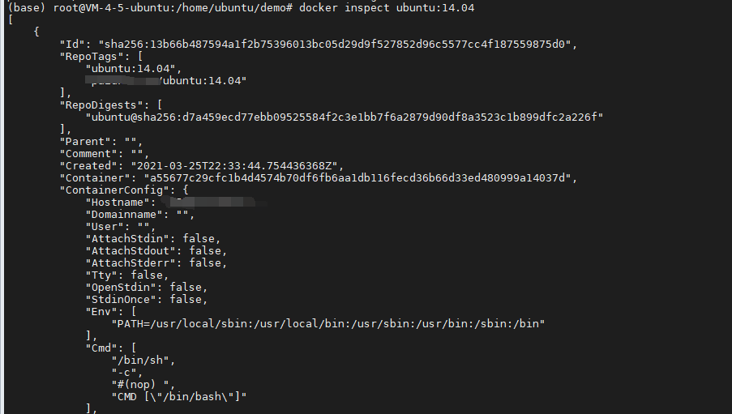

## Docker  三个基本概念

- 镜像 image
- 容器 container
- 仓库 repository

#### 镜像

> 分层存储：镜像是一个虚拟的概念，由一组文件系统组成，或者说是多层的文件系统联合组成
>
> 镜像构建时，一层一层构建，前一层是后一层的基础，每一层构建完就不再发生改变，后一层的任何改变只发生在自己这层。比如删除上一层的文件，仅是在当前层做了一个标记为已删除。
>
> 虽然标记看不到这个文件，但实际上一直跟随镜像。因此构建每一层尽量只包含这层需要的东西，额外的东西这层构建结束前清理掉。

#### 容器

> 容器实质是进程，但与直接在宿主执行的进程不同，容器进程运行在自己的独立命名空间，拥有自己的 root文件系统、网络配置、进程空间、甚至自己的用户ID空间。容器内的进程运行在一个隔离的环境中，类似一个独立于宿主的系统下操作一样。

> 按照 Docker最佳实践的要求，容器不应该向存储层写任何的数据，容器保持无状态化，所有的文件写入操作都应该使用数据卷或者绑定宿主目录，直接对宿主进行读写，性能和稳定性更高。
>
> 数据卷的生存周期独立于容器，容器消亡，数据卷不会消亡。

#### 仓库

> 一个仓库会包含同一个软件不同版本的镜像，tag对应各个版本，<仓库>:<标签>，如果不给出标签将以 least作为默认标签。

## Docker 镜像

> docker 运行容器前本地存在对应镜像，如果不存在，从 docker仓库中拉取

> docker pull ubuntu:14.04
>
> docker run -it  - -rm ubuntu:14.04 bash
>
> docker images
>
> docker images -a
>
> docker images ubuntu:14.04
>
> docker images -q	(只列出镜像ID)
>
> docker images --format "{{.ID}}:{{.Repository}}"	(支持GO的模板语法)
>
> docker run -d ubuntu:14.04
>
> docker logs ubuntu:14.04
>
> docker logs -f ubuntu:14.04

#### 镜像体积

> Ubuntu: 14.04 体积大小197MB，docker hub大小却是50MB，这是因为docker hub中的体积被压缩，镜像下载和上传都保持着压缩状态，本地的体积是展开后的大小，也就是各层展开后体积总和。

镜像是容器的基础，镜像是多层存储，每一层在前一层的基础上进行的修改，容器以镜像为基础层，基础上再加上一层运行时的存储层。

#### commit定制

> docker run --name webserver -d -p 2333:80 nginx
>
> 拉取Nginx镜像，宿主机2333端口映射到容器的80端口，起名webserver，后台运行
>
> 
>
> docker exec -it webserver /bin/bash
>
> echo '<h3>hello world!</h3>'  >  /usr/share/nginx/html/index.html
>
> docker diff webserver	(查看容器的存储层)
>
> 
>
> 如果不使用数据卷，任何对文件的修改都会被记录在容器的存储层
>
> docker commit --author "paidx0" --message "测试镜像docker commit" webserver test:v1
>
> 
>
> docker commit 创建新的定制镜像
>
> docker history test:v1	（查看镜像内的历史记录）
>
> 
>
> 不建议使用 docker commit
>
> 任何修改的结果仅仅是在当前层进行标记，而不会改变上一层，如果使用 docker commit制作镜像，后期的修改会使得镜像更加臃肿，上一层的东西并不会丢失而是一直跟随镜像，即便是访问不到。

#### Dockerfile镜像

###### FROM 基础镜像

> 注意 scratch 是一个特殊的虚拟镜像，并不存在，表示一个空白镜像。
>
> 对于静态编译的程序来说，并不需要操作系统提供运行时的支持，所需要的库都已经在可执行文件中，所以直接用 scratch作为基础镜像可以让镜像体积更小。也就是为什么GO语言特别适合微服务架构的语言。

###### RUN 执行命令

> RUN是创建docker镜像时的步骤
>
> RUN echo '<h3>hello world!</h3>'  >  /usr/share/nginx/html/index.html
>
> RUN 就像 shell一样可以执行命令，但是，dockerfile 中的每一个指令都会建立一层，创建太多层镜像是完全没有意义的，而且很多不必要的东西也被加入镜像中，比如编译环境和安装更新软件包。
>
> Union FS 有最大层数限制，不超过 127层。
>
> 
>
> 为什么呢，还是因为每层是单独的，分开写的话 update并没有对 install起到作用，还是使用旧的软件包下载 curl

###### COPY 复制

> COPY package.json /app/server
>
> 同样支持GO通配符
>
> COPY web*.txt /app/server

###### ADD 复制

> ADD 在COPY基础上更高级的复制，源文件可以是URL，Docker引擎会尝试去下载这个链接文件到目标路径，权限600。
>
> 如果源文件是 tar压缩文件，压缩格式 gzip、bzip2、xz，ADD指令会自动解压缩。
>
> Docker官方更推荐使用 COPY，语义明确仅复制文件，在满足自动解压缩的情形下，可以使用ADD。

###### CMD 容器命令

> CMD是docker镜像被启动后容器将会默认执行的命令，一个dockerfile仅最后一个CMD起作用，可以重载CMD命令
>
> - shell 格式：CMD <命令>
> - exec 格式：CMD ["可执行文件"，"参数1"，"参数2"]
>
> 推荐使用 exec格式，会被解析成JSON数组，一定要使用双引号，而不是单引号。
>
> CMD echo $HOME  => CMD ["sh"，"-c"，"echo $HOME"]
>
> shell格式会加上 sh -c 包裹

######  ENTRYPOINT

> 当指定了ENTRYPOINT以后，CMD就发生了改变，不再是直接运行命令，而是CMD的数组作为参数传给ENTRYPOINT。

###### ENV 环境变量

> ENV <key>=<value> <key>=<value> <key>=<value>
>
> 设置环境变量，后续指令可以直接使用定义的环境变量

###### ARG 构建

> ARG <参数名> [=<默认值>]
>
> 设置构建环境时的环境变量，docker build 可用 - -build-arg <参数名>=<值> 覆盖修改

###### VOLUME 匿名卷

> VOLUME ["路径1","路径2"]
>
> 保持容器存储层无状态化，数据文件保存在卷中，为了防止运行时忘记将目录挂载为卷，可以先指定某些目录挂载为匿名卷，这样即使忘记指定挂载卷，也可以正常运行，不会向容器储存层写入数据。

###### EXPOSE 端口

> EXPOSE 声明运行时容器提供服务的端口，但是只是一个声明，仅声明容器准备使用哪些端口，并不代表运行时就会开启这个端口的服务。
>
> EXPOSE 的作用一个是帮助理解某个服务的端口，方便配置相应的映射，还有就是 docker run -p 时会随机端口映射，如果指定了EXPOSE，会自动映射EXPOSE的端口。

###### WORKDIR

> WORKDIR 指定工作目录，以后的各层当前目录被改为指定的工作目录，如果目录不存在是不会自动创建的。

###### USER

> USER 指定当前用户，以后的各层当前用户被改为指定的用户。
>
> 不推荐使用 su或者 sudo，需要较麻烦的配置，推荐使用gosu
>
> 

###### ONBUILD

> ONBUILD <指令>
>
> 这个指令比较特殊，后面跟着的指令不会在当前构建的镜像被执行，只有当以当前镜像为基础镜像，去构建下一层镜像时才会被执行。
>
> ONBUILD 为了帮助别人定制镜像而准备的。

#### 镜像构建

> docker  build  -t  仓库:标签   .
>
> 默认是构建文件 Dockerfile，也可以使用 -f  指定构建的那个文件
>
> 最后面的点表示context，表示打包当前目录下的所有文件到docker daemon，然后到REST API 背后的docker引擎构建，所以COPY等一些操作需要的文件要复制到当前目录，而不是简单的一个路径。
>
> .dockerignore  表示构建打包时需要忽略的文件

> docker通过 REST API 与docker引擎交互，表面一切命令都是在本地完成，实际上都是远程调用docker引擎完成。

#### 镜像导入导出

> docker import  [选项] <文件>|<URL>|-  [<仓库>:<标签>]
>
> docker save Ubuntu  |  gzip  > Ubuntu-latest.tar.gz
>
> docker load -i  Ubuntu-latest.tar.gz
>
> 利用 ssh和管道从一个机器迁移到另一个机器
>
> docker save Ubuntu  | bzip2 | pv | ssh  root@127.0.0.1  ' cat | docker  load '

#### 删除镜像

> docker  rmi  Ubuntu
>
> 删除所有镜像
>
> docker  rmi  $(docker  images  -q)
>
> docker  rmi  $(docker  images  -q  ubuntu)

## Docker 容器

> docker run  Ubuntu:14.04  -it  /bin/bash
>
> ps
>
> docker  start  Ubuntu:14.04
>
> docker  logs  ubuntu:14.04
>
> docker stop  Ubuntu:14.04
>
> docker restart Ubuntu:14.04

#### 容器导入导出

>  docker export 220ba3bea773 > ubuntu.tar
>
>  cat ubuntu.tar | docker import - new/ubuntu:14.04
>
> 
>
> docker  import  URL  new/Ubuntu：test
>
> docker load 和 docker import 都可以导入镜像到本地
>
> 区别在于前者将保存完整记录，体积较大，后者丢弃所有的历史记录和元数据信息，仅保存容器当时的快照状态

#### 删除容器

> docker rm  Ubuntu:14.04
>
> docker rm $(docker  ps -a -q)

## Docker 仓库

> paidx0.com/Ubuntu：14.04
>
> 用户服务器/仓库名:标签
>
> docker login
>
> docker search ubuntu
>
> docker pull  Ubuntu

#### 私有仓库

> docker run -d -p 5000:5000 registry

#### 提交docker hub

>  docker tag test:v1 paidxing0/test:v1
>
>  docker push paidxing0/test:v1
>
> 
>
> 

## Docker 数据管理

#### 数据卷

> 数据卷可供一个或多个容器使用的特殊目录
>
> - 数据卷可以在容器之间共享和重用
> - 对数据卷的修改会立即生效
> - 对数据卷的更新不会影响镜像
> - 容器删除数据卷也会一直存在
>
> docker run -v 指定创建一个数据卷挂载到容器里，可以挂载多个数据卷。
>
> dockerfile 中 VOLUME来添加数据卷到一个新的容器。
>
>  删除容器的同时移除数据卷 docker rm -v
>
> docker 挂载数据卷的默认权限是读写，可以通过 :ro 指定为读写
>
> docker run -d -p - -name webserver -v /src/webapp:/app/webapp:ro   ubuntu:14.04

> 查看容器信息
>
> docker inspect Ubuntu:14.04
>
> 
>
> docker run - -rm  -it  -v  ~/.bash_history:/.bash_history  ubuntu:14.04  /bin/bash
>
> 记录容器输入过的命令

#### 数据卷容器

> 数据卷容器在一些持续更新的数据在容器之间共享，就是一个容器专门用来提供数据卷其他容器挂载。

> 创建dbdata数据卷容器
>
> docker run -d  -v  /dbdata  - -name dbdata ubuntu:14.04
>
> 其他容器挂载dbdata容器中的数据卷
>
> docker run -d  - -volumes-from  dbdata  - -name db1  ubuntu:14.04
>
> docker run -d  - -volumes-from  dbdata  - -name db2  ubuntu:14.04
>
> 还可以从多个容器挂载不同的数据卷
>
> docker run -d  - -volumes-from  db1  - -name db3  ubuntu:14.04

> 备份
>
> docker run   - -volumes-from  dbdata  -v  $(pwd):/backup  ubuntu:14.04  
>
> tar  cvf   /backup/backup.tar  /dbdata

> 恢复
>
> docker  run  -v  /dbdata  - -name  dbdata1  ubuntu:14.04  /bin/bash
>
> docker run  - -volumes-from  dbdata1  -v  $(pwd):/backup  ubuntu
>
> tar  xvf  /backup/backup.tar

## Docker 网络

> docker run -d  -P  随机映射一个49000~49900的端口到容器端口
>
> docker run -d  -p  80:80 指定映射的端口
>
> docker run -d  -p  127.0.0.1:80:80  指定地址
>
> docker run -d  -p  127.0.0.1: :80  指定地址任意端口
>
> docker  port  webserver  80  查看端口映射

#### 容器互联

> docker run  - -link  要链接的容器：这个链接的别名
>
> 启动容器的时候不需要使用 -p或 -P，避免暴露端口到外部网络，可以 ping通容器

> docker会自动在宿主机上创建一个 docker0虚拟网卡，桥接模式，挂载到网口进行转发。容器接口一端 eth0，另一端在本地docker0网桥上，以veth开头命名，实现主机和容器的通信。

> -b  bridge	指定容器挂载的网桥
>
> -H  socket  或者  - -host=socket	指定docker服务端接收命令的通道
>
> –iptables=true|false	指定防火墙规则
>
> –dns=IP_ADDRESS	指定DNS服务器
>
> –dns-search=DOMAIN	指定DNS搜索域
>
> -h  hostname	指定容器主机名

#### 桥接模式

> –network  bridge |none |host	指定容器的桥接模式
>
> docker  network  create  -d  bridge  demo	创建命名为demo的bridge网络模式
>
> docker  network  inspect  demo	查看网络模式

> docker  run  - -name  test1   - -network  demo  -d  ubuntu
>
> docker  run  - -name  test2   - -network  demo  -d  ubuntu
>
> 以demo网络创建的进程可以互相访问ping通。

> 如果是以 none模式创建，则是独立的，因为这种模式根本不会生成虚拟网卡，所以也就根本不可互通，独立存在。

> 如果是以 host模式创建的，则是与宿主机共网卡，不是虚拟出一张网卡。

#### 容器访问控制

> 容器想要访问外部网络，需要本地系统的转发支持
>
>  sysctl net.ipv4.ip_forward
>
> 如果 net.ipv4.ip_forward = 0，说明没有开启转发，手动打开
>
> sysctl  -w  net.ipv4.ip_forward = 1

> 容器之间的互相访问需要容器互联，本地防火墙- -iptables允许通过，默认所有容器是连接到docker0 网桥上。

#### 自定义网桥

> 需要先停止docker服务，删除旧的网桥
>
> service  docker  stop
>
> ip  link  set  dev  docker0  down
>
> brctl  delbr  docker0
>
> 创建新的网桥 bridge0
>
> brctl  addbr  bridge0
>
> ip  addr  add  192.168.10.1/24  dev  bridge0
>
> ip  link  set  dev  bridge0  up
>
> 查看网桥
>
> ip  addr  show  bridge0
>
> 配置docker服务默认桥接到新网桥
>
> echo  'Docker_OPTS="-b=bridge0" ' >> /etc/default/docker
>
> service  docker start